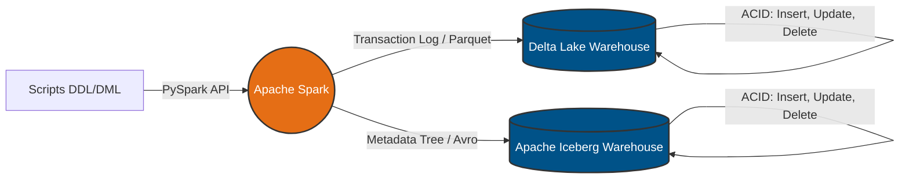

# Engenharia de Dados — Lakehouse para Sistema de Despachos

[](https://www.python.org/downloads/)
[](https://github.com/astral-sh/uv)
[](https://TiagoPalacio.github.io/Projeto_Eng_de_dados/)

Repositório desenvolvido para o trabalho de pesquisa da disciplina de Arquitetura de Dados. O projeto demonstra a criação e manipulação de dados transacionais utilizando **Apache Spark**, **Delta Lake** e **Apache Iceberg** em um ambiente Python local, simulando as operações de um aplicativo de logística e despachos.

---

## 🏗️ Desenho de Arquitetura

O fluxo do projeto consiste na modelagem de um banco de dados transacional (tabelas `motoristas` e `corridas`). O Apache Spark atua como motor de processamento, aplicando comandos DML (Insert, Update, Delete) diretamente nas camadas de armazenamento Delta e Iceberg para comprovar a eficácia das transações ACID.



---

## 🛠️ Pré-requisitos e Ferramentas

| Componente | Detalhe |
|---|---|
| **Sistema Operacional** | Windows (com scripts de adaptação nativos) / Linux / macOS |
| **Linguagem** | Python 3.11 |
| **Runtime** | Java 17 (Microsoft OpenJDK) — Obrigatório para o motor do Spark |
| **Gerenciador de Pacotes** | uv |
| **Processamento** | PySpark (v3.5.1) |
| **Lakehouse** | Delta-Spark (v3.2.0) e PyIceberg |
| **Ambiente/IDE** | Visual Studio Code (com extensões Python e Jupyter) |
| **Documentação** | MkDocs (Material Theme) |

---

## ⚙️ Instalação e Configuração

### 1. Instalar o gerenciador uv (caso não possua)

Utilizamos o uv para garantir a velocidade e o isolamento das dependências.

**No Windows (PowerShell):**
```powershell
powershell -ExecutionPolicy ByPass -c "irm https://astral.sh/uv/install.ps1 | iex"
```

**No Linux / macOS / Git Bash:**
```bash
curl -LsSf https://astral.sh/uv/install.sh | sh
```

---

### 2. Clonar o repositório

```bash
git clone https://github.com/TiagoPalacio/Projeto_Eng_de_dados.git
cd Projeto_Eng_de_dados
```

---

### 3. Sincronizar o ambiente virtual

Execute o comando abaixo para criar o `.venv` e instalar todas as bibliotecas necessárias forçando a versão correta do Python:

```bash
uv sync --python 3.11
```

---

## ▶️ Como Executar Localmente

Todo o código foi estruturado em Jupyter Notebooks para facilitar a visualização passo a passo das operações no banco de dados.

1. Abra a pasta do projeto no **Visual Studio Code**  
2. Certifique-se de selecionar o kernel do ambiente virtual (`.venv`) gerado pelo uv no canto superior direito da interface  
3. **Para testar o Delta Lake:** Abra o arquivo `delta_lakehouse.ipynb` e execute as células  
4. **Para testar o Apache Iceberg:** Abra o arquivo `iceberg_lakehouse.ipynb` e execute as células  

> **Nota para usuários Windows:**  
> Não é necessário configurar o `HADOOP_HOME` manualmente. Os notebooks possuem um script inicial que faz o download e a injeção automática dos binários `winutils.exe` e `hadoop.dll` em tempo de execução.

---

## ⚠️ Solução de Problemas Comuns

- **Erro no Java/Py4J ao iniciar o Spark:**  
  Se a primeira execução de uma célula falhar informando erros relacionados ao Hadoop ou Py4J, basta clicar no botão **Restart** (Reiniciar Kernel) no topo da interface do Jupyter no VS Code e rodar a célula novamente. Isso limpa a memória e permite que o script do Windows injete os binários corretamente.

- **Pastas de Warehouse:**  
  As pastas `spark-warehouse` e `iceberg_warehouse` são geradas automaticamente na raiz do projeto ao executar as células de criação das tabelas. Elas estão ignoradas no `.gitignore` para não pesar o repositório.

---

## 📚 Documentação (MkDocs)

A base de conhecimento, incluindo o Modelo Entidade-Relacionamento (ER) e o detalhamento das tecnologias, está armazenada na pasta `docs/`.

### Para rodar o site localmente:

```bash
uv run --python 3.11 mkdocs serve
```

Acesse: http://127.0.0.1:8000/

---

### Para publicar a documentação online:

```bash
uv run --python 3.11 mkdocs gh-deploy
```

**Acesse o site público aqui:** Documentação do Projeto

---

## 👥 Colaboração

1. Abra uma **issue** para discutir melhorias ou correções  
2. Crie um **branch**:
```bash
git checkout -b feature/minha-melhoria
```
3. Faça suas alterações e **commit**  
4. Envie um **pull request** para a branch `main`  

---

## 👨‍💻 Autores

- **Tiago Fritzen Palácio**  
- **Bruno Tescke**  
- **Gabriel Tomé**

---

## 📄 Licença

Este projeto é acadêmico e de código aberto.

---

## 🔗 Referências

- Apache Spark - Documentação Oficial  
- Delta Lake - Guia Rápido PySpark  
- Apache Iceberg - Spark Quickstart  
- MkDocs Material  
