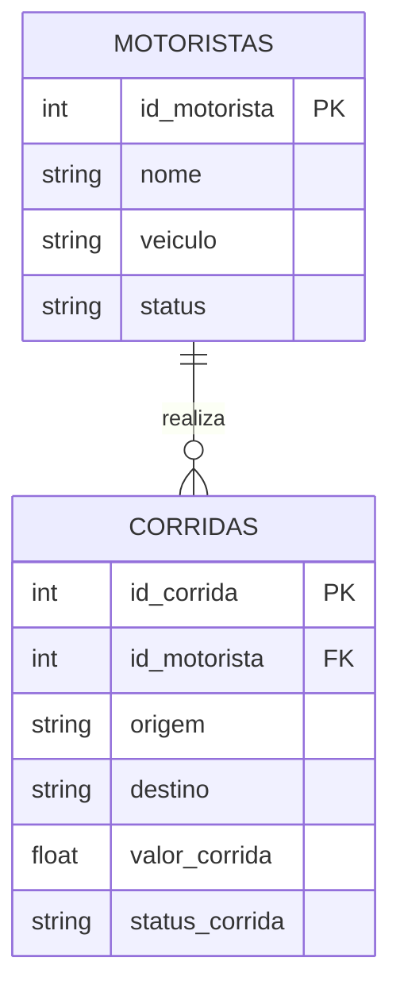

# 📦 Sistema de Despachos: Arquitetura Lakehouse

Este site documenta o trabalho de pesquisa da disciplina de Arquitetura de Dados sobre Apache Spark, Delta Lake e Apache Iceberg.

## 🎯 Contextualização do Cenário
Para evidenciar o uso das tecnologias de Lakehouse, modelamos um banco de dados transacional focado em um **Sistema de Despachos e Logística**. Escolhemos esse cenário pois o status de motoristas e as viagens (corridas) mudam constantemente, exigindo transações ACID robustas.

### Modelo Entidade-Relacionamento (ER)
O banco de dados é composto por duas tabelas principais, relacionadas através do `id_motorista`:

